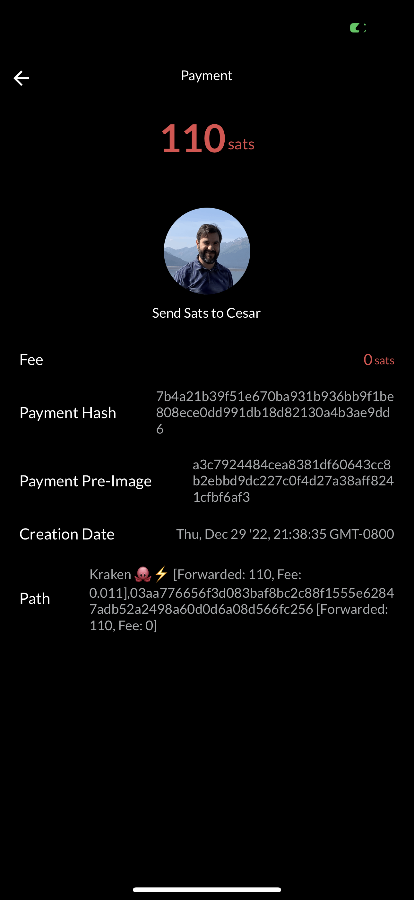

# About

A small utility program I wrote to manage lightning address payments to my node.

# Setup

1. Create a application macaroon
```shell
lnd $ lnd-cli bakemacaroon invoices:read invoices:write address:read address:write --save_to ./app.macaroon
```
2. Create a python virtual env
```shell
lnd $ python3 -m venv .env
```

3. Source the environment
```shell
lnd $ source .env/bin/activate
```

4. Install dependencies
```shell
lnd $ pip install -r requirements.txt
```

5. Run the server
```shell
lnd $ ./lnurl --server
```

# Screenshots



# Production

A sample system d file
```
[Unit]
Description=LND Lightning Address
Requires=lnd.service
After=lnd.service

[Service]
ExecStart=/usr/local/lnurl/.env/bin/python3 /usr/local/lnurl/lnurl --server --macaroon=/usr/local/lnurl/app.macaroon --image-thumb=/usr/local/lnurl/image-thumb.png
User=www-data
Group=www-data
Type=simple
KillMode=process
TimeoutSec=180
Restart=always
RestartSec=60

[Install]
WantedBy=multi-user.target
[Unit]
Description=LND Lightning Address
Requires=lnd.service
After=lnd.service

[Service]
ExecStart=/usr/local/lnurl/.env/bin/python3 /usr/local/lnurl/lnurl --server --macaroon=/usr/local/lnurl/app.macaroon --image-thumb=/usr/local/lnurl/image-thumb.png
User=www-data
Group=www-data
Type=simple
KillMode=process
TimeoutSec=180
Restart=always
RestartSec=60

[Install]
WantedBy=multi-user.target
```

It's recommened you host the server behind a nginx, etc.